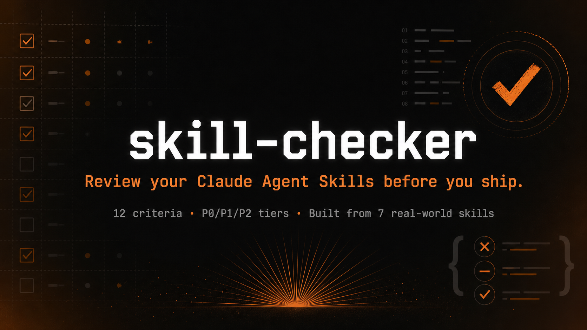
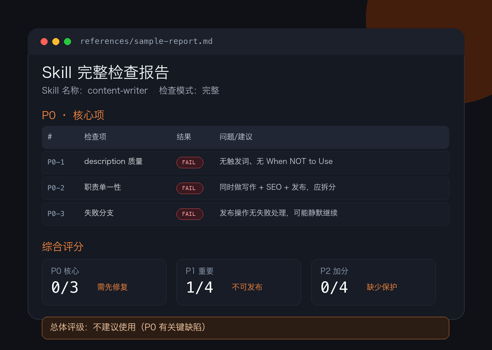

<p align="center">
  
</p>

<h1 align="center">skill-checker</h1>

<p align="center">
  <strong>Review your Claude Agent Skills before you ship.</strong>
</p>

<p align="center">
  
  
  
  
</p>

`skill-checker` 是一个 Claude Agent Skill 发布前检查器，用 P0/P1/P2 分层标准检查 `SKILL.md` 的结构、触发、边界和风险。

---

## 它解决什么

很多 skill 在发布前最容易漏掉三类问题：

- description 写得太泛，Claude 不知道什么时候触发。
- 正常路径完整，失败分支缺失。
- 工具权限、破坏性操作和方法论边界没有收住。

`skill-checker` 会把这些问题整理成可执行的检查报告，直接告诉你能不能发、哪里先改。

## 检查维度

| 层级 | 检查项 |
|---|---|
| P0 核心 | description 质量、职责单一性、失败分支处理 |
| P1 重要 | 配置具体性、产出可判定性、正文长度、渐进式披露 |
| P2 加分 | 样例质量、权限收敛、破坏性操作保护、方法论专项、迭代友好性 |

## 输出预览

<p align="center">
  
</p>

完整样例见 [references/sample-report.md](references/sample-report.md)，包含一个有典型问题的 skill 和对应检查报告。

## 安装

```bash
git clone https://github.com/wtfitsme-design/skill-checker ~/.claude/skills/skill-checker
```

重启 Claude Code 后生效。

## 使用

直接对 Claude 说：

```text
帮我检查这个skill
```

也可以换成：

- `我写的skill有没有问题`
- `我写的skill好不好`
- `检查一下我的skill`
- `review my SKILL.md`
- `validate my skill`

然后粘贴 `SKILL.md` 内容，或提供文件路径。

## 检查模式

| 模式 | 触发方式 | 覆盖范围 |
|---|---|---|
| 完整检查 | 默认 | P0 + P1 + P2 |
| 快速检查 | 说“快速检查”或“只看 P0” | 只跑核心项 |

## 来源

检查标准提炼自这些开源项目的分析：wechat-topic-radar、typefully、daymade deep-research、Jeffallan skills、market-insight、trailofbits、ask-questions。

以上项目均为开源项目，分析仅供学习参考，设计思路归原作者所有。

## License

[MIT](LICENSE)
